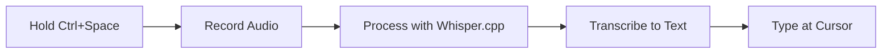

# 🎙️ Voice-to-Text Desktop App

> **A fully offline, lightning-fast voice-to-text application powered by Whisper.cpp**

[](https://www.python.org/downloads/)
[](LICENSE)
[]()

Transform your voice into text instantly with a simple keyboard shortcut. No internet required, completely free, and your data never leaves your computer.


---

## ✨ Features

- 🚀 **Blazing Fast** - Transcribe speech in 1-2 seconds
- 🔒 **100% Offline** - No API calls, no internet required
- 💰 **Completely Free** - No subscriptions, no hidden costs
- 🎯 **Universal** - Works in any application (Word, browser, email, etc.)
- ⚡ **Hold-to-Record** - Simply hold Ctrl+Space while speaking
- 🔐 **Private** - All processing happens locally on your machine
- 🎨 **Lightweight** - Minimal resource usage, no system lag

---

## 🎬 Quick Demo

1. **Press and hold** `Ctrl + Space`
2. **Speak** naturally into your microphone
3. **Release** the keys when done
4. **Text appears** instantly where your cursor is!

---

## 🚀 Quick Start

### Prerequisites

- Python 3.10 or higher
- A working microphone
- Windows, macOS, or Linux

### Installation

1. **Download this repository**
   ```bash
   git clone https://github.com/yourusername/voice-to-text-app.git
   cd voice-to-text-app
   ```

2. **Install dependencies**
   ```bash
   pip install -r requirements.txt
   ```

3. **Run the application**
   ```bash
   python voice_to_text.py
   ```

4. **Start using it!**
   - Hold `Ctrl + Space` while speaking
   - Release when done
   - Your text appears automatically

---

## 📖 How It Works

This application uses **Whisper.cpp** - a high-performance C++ implementation of OpenAI's Whisper model - to transcribe speech locally on your machine.



**Technology Stack:**
- **Whisper.cpp** - Fast, local speech recognition
- **Python** - Application logic and hotkey handling
- **sounddevice** - Audio capture
- **pyautogui** - Text injection

---

## ⚙️ Configuration

Easily customize the app by editing the configuration section in `voice_to_text.py`:

```python
# Hotkey configuration
HOTKEY = "ctrl+space"  # Change to your preferred hotkey

# Recording settings
MAX_DURATION = 30  # Maximum recording duration in seconds

# Whisper model (larger = more accurate but slower)
WHISPER_MODEL = "ggml-tiny.en.bin"  
# Options: tiny.en, base.en, small.en, medium.en, large
```

### Available Models

| Model | Size | Speed | Accuracy | Use Case |
|-------|------|-------|----------|----------|
| `tiny.en` | 77 MB | ⚡⚡⚡ | ⭐⭐ | Fast, everyday use |
| `base.en` | 142 MB | ⚡⚡ | ⭐⭐⭐ | Balanced |
| `small.en` | 466 MB | ⚡ | ⭐⭐⭐⭐ | High accuracy |
| `medium.en` | 1.5 GB | 🐌 | ⭐⭐⭐⭐⭐ | Maximum accuracy |

---

## 🌍 Multi-Language Support

For non-English languages, use the multilingual models:

```python
WHISPER_MODEL = "ggml-tiny.bin"  # Remove .en suffix
```

Supports 90+ languages including Spanish, French, German, Chinese, Japanese, and more!

---

## 🎯 Use Cases

- 📝 **Writing** - Dictate documents, emails, and notes
- 💬 **Messaging** - Quick voice-to-text in chat apps
- 🎓 **Study** - Transcribe lectures and thoughts
- ♿ **Accessibility** - Hands-free text input
- 🎮 **Gaming** - Voice chat transcription
- 📊 **Productivity** - Faster data entry

---

## 🛠️ Troubleshooting

### No text appears?
- ✅ Check microphone permissions in Windows Settings → Privacy → Microphone
- ✅ Increase microphone volume in Sound Settings
- ✅ Make sure you're in a text field before using the hotkey

### App is slow?
- ✅ Close other resource-heavy applications
- ✅ Use the `tiny.en` model for fastest performance
- ✅ Check your CPU usage

### Hotkey not working?
- ✅ Try a different key combination in settings
- ✅ Some apps block global hotkeys - try in a different application
- ✅ On macOS, grant Accessibility permissions

For more help, check the [Issues](https://github.com/yourusername/voice-to-text-app/issues) page.

---

## 📊 System Requirements

| Component | Minimum | Recommended |
|-----------|---------|-------------|
| **OS** | Windows 10, macOS 10.14, Linux | Latest version |
| **RAM** | 2 GB | 4 GB+ |
| **Storage** | 200 MB | 500 MB |
| **CPU** | Dual-core | Quad-core+ |
| **Microphone** | Any | Quality headset |

---

## 🤝 Contributing

Contributions are welcome! Here's how you can help:

1. 🐛 Report bugs in [Issues](https://github.com/yourusername/voice-to-text-app/issues)
2. 💡 Suggest new features
3. 🔧 Submit pull requests
4. 📖 Improve documentation
5. ⭐ Star this repository

---

## 📜 License

This project is licensed under the MIT License - see the [LICENSE](LICENSE) file for details.

---

## 🙏 Acknowledgments

- [Whisper.cpp](https://github.com/ggerganov/whisper.cpp) by Georgi Gerganov
- [OpenAI Whisper](https://github.com/openai/whisper) for the original model
- All contributors and users of this project

---

## 📞 Support

- 📧 **Email**: your.email@example.com
- 💬 **Discord**: [Join our community](https://discord.gg/yourlink)
- 🐦 **Twitter**: [@yourusername](https://twitter.com/yourusername)
- ⭐ **Star this repo** if you find it useful!

---

## 🗺️ Roadmap

- [ ] GUI interface for easier configuration
- [ ] Custom vocabulary support
- [ ] Real-time transcription mode
- [ ] Export transcriptions to file
- [ ] Mobile app version
- [ ] Browser extension

---

## 📈 Stats


---

<div align="center">

**Made with ❤️ by [Your Name](https://github.com/yourusername)**

If this project helped you, please consider giving it a ⭐!

[Report Bug](https://github.com/yourusername/voice-to-text-app/issues) · [Request Feature](https://github.com/yourusername/voice-to-text-app/issues) · [Documentation](https://github.com/yourusername/voice-to-text-app/wiki)

</div>
